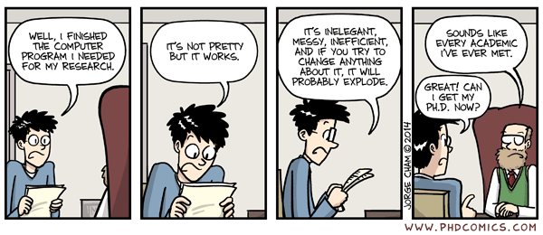

## Introduction

- These slides are a summary of my **personal experience**
- They are not exhaustive, bleeding edge or perfect
- But rather the consequence of doing things the wrong way

### **I don't code in R, can I leave?**

Of course, no offense taken. 
But: 

- You will most likely be interested in these concepts
- Especially, shaping your production into a package/module/library
- Proper development shares core ideas, available in language-specific tools


## Motivation (1)

<!--- http://www.phdcomics.com/comics/archive/phd032614s.gif -->



## Motivation (2)

<!--- http://www.phdcomics.com/comics/archive/phd031214s.gif  -->


Interestingly, both persons can be the same person, i.e. **you**


*> Your closest collaborator is you six months ago, 
but you don't reply to emails.* 

    -- Paul Wilson, UW-Madison

## Why R packages, specifically?

- Requires more work... at the beginning -- but eventually it pays off!
- You help yourself by documenting, structuring and testing your software
- You help others using your wonderful algorithms
- **Eases reproducible research**
- Improves your impact and visibility
- It sounds cool

## Important bits

For **any** package that you write:

- Adhere to good coding practices
- Stick to the standard directory structure
- Use version control
- Test your code systematically
- Document **everything** 

If you want to publish your bioinformatics software:

- Ideally in [Bioconductor](https://bioconductor.org/), but
[CRAN](https://cran.r-project.org/) is also possible
- Write a walkthrough with real code (vignette)
- Endorse your work with a license

## Package structure: folders

`data-raw/` scribbles and scripts to generate datasets

`data/` data that comes with the package, loadable with `data()`

`inst/` persistent files after install, internally accessed with `system.file()`

`man/` documentation files in `.Rd` format, automatically generated

`R/` R functions, organised into `.R` text files

`src/` source code if other languages are used, e.g. `C++`

`tests/` unit testing, usually in `.R` files in `tests/testthat/`

`vignettes/` source files to build vignettes (`.Rmd` or `.Rnw`), images, etc

## Package structure: files

These files require manual maintenance, excluding `NAMESPACE`

`.Rbuildignore` files ignored when building the package: `data-raw`, `.Rproj`, ...

`.gitignore` files that should not be tracked by `git`

`.travis.yml` (optional) rules for [Travis CI](https://travis-ci.org/) 
continuous integration

`DESCRIPTION` author metadata and dependency statements

`LICENSE` (optional) copy of the software license agreement

`NAMESPACE` (automatic) exported functions and classes

`NEWS` log of the software improvements, by version number

`README.md` README page greeting you on GitHub


## Package files: DESCRIPTION

```r
Package: rmini
Version: 0.0.4
Date: 2014-04-18
Title: A Minimal R Package as an Example of Writing R Packages
Author: Yihui Xie
Maintainer: Yihui Xie <xie@yihui.name>
Depends:
    R (>= 3.1.0)
Imports:
    tools
Suggests:
    roxygen2,
    knitr
Description: A minimal R package that shows you how to write R packages with
    roxygen documentation, S3 methods, vignettes, tests, and C code, etc.
License: GPL
URL: https://github.com/yihui/rmini
BugReports: https://github.com/yihui/rmini/issues
VignetteBuilder: knitr
```

## Package files: NAMESPACE

```r
S3method("+",Foo)
S3method(hello,character)
S3method(hello,default)
export(hello)
export(reverse)
export(rock_fun)
export(split_filename)
importFrom(tools,file_ext)
importFrom(tools,file_path_sans_ext)
useDynLib(rmini)
```

## Package files: README.md

```html
[]
(https://travis-ci.org/yihui/rmini)

Everything about an R package when you want to learn how to 
develop an R package. Specifically, it has examples for

- DESCRIPTION
- roxygen documentation
- namespace
- S3 generic functions
- C code
- datasets
- demos
- R Markdown vignettes
```

## Package files: NEWS

```html

CHANGES IN VERSION 1.1.6
------------------------

    o Fixed vignette indices

CHANGES IN VERSION 1.1.5
------------------------

    o Added full vignette on the zebrafish dataset
    
    o Small modifications to the Mus musculus vignette
```
## devtools is your friend

Really, it is handy.

- `load_all()`
- `build()`
- `install()`

For testing: 

- `check()`
- `run_examples()`

For generating documentation and `NAMESPACE`:

- `document()`

## Version control with git (1)

The versioning control from [`git`](https://git-scm.com/) 
and its implementations 
([GitHub](https://github.com/), [GitLab](https://gitlab.com/)) 
or similar tools 
([mercurial](https://www.mercurial-scm.org/), 
[svn](https://subversion.apache.org/))
is **MANDATORY** -- no buts.

Learning `git` takes time, but will avoid you countless 
situations of total despair. 

1. Create a (usually private) repository in our GitHub or GitLab: e.g. `foo`
2. Clone it in your machine: `git clone https://github.com/b2slab/foo`
3. Edit the files (e.g. create a `README` and a `NEWS` file)
4. Add your changes: `git add README NEWS`
5. Commit: `git commit -m 'An informative commit message'`
6. Push current branch to the server: `git push origin master`
7. Keep repeating steps 3-6 

## Version control with git (2)

`git` enables you to:

- Go back to any (tracked) commit from the past
- Create branches for testing changes without compromising the main version
- Work collaboratively, spot conflicts and solve them
- Manage tickets for bug fixes or feature requests
- Distribute your software
- Keep track of your progression

`git` forces you to:

- Document your changes
- Manage your data, e.g. avoid huge or thousands of scattered files
- Decide what to track, defined in `.gitignore`

## Documentation with roxygen2

```r
#' Add together two numbers
#'
#' @param x A number
#' @param y A number
#' @return The sum of \code{x} and \code{y}
#' @examples
#' add(1, 1)
#' add(10, 1)
add <- function(x, y) {
  x + y
}
```

1. Document all your functions, classes and datasets in place
2. Include **runnable examples**
3. `roxygen2::roxygenise()` or `devtools::document()` 
to generate `.Rd` files
4. Enjoy inner peace

## Unit testing with testthat 

```r
test_that("dummy sum works on small data", {
  # add() is aprox 3.0
  expect_equal(3.0, add(1.0, 2.0))
  # add() is exactly 3.0
  expect_identical(3.0, add(1.0, 2.0))
})
```

1. Write small and light tests for each topic into `tests/testthat`
    - Toy examples with known solutions
    - Check exceptions and edge cases
    - Ensure class consistency
2. Every time you change something, run `devtools::test()`
3. Enjoy inner peace

## Debugging

[Rstudio](https://www.rstudio.com/) is a ~~hell of an~~ top-notch IDE.

Combined with `devtools`, debugging is ~~easy~~ less painful:

1. Place breakpoints in the function under inspection
2. `devtools::load_all()`
3. Execute the offending code

Other ways:

- `debug()` 
- `browser()` statemets
- Avoid problems in the first place by checking arguments, e.g. `checkmate`

## Vignettes

Every Bioconductor package comes with at least one vignette.
The user can find vignettes in the `foo` package 
using `browseVignettes("foo")`

- Usually `.Rmd` (R markdown) or `.Rnw` (R sweave) in `vignettes/`
- Built through packages like `rmarkdown` or `knitr`
- Have runnable code combined with a markup language
- Can be built anytime in a reasonable time
- As well as the code, they **must be maintained**
- Adhere to styling guidelines, e.g. using `BiocStyle` package

Why having vignettes at all?

- Explain package's design and main functions, also **for your future self**
- Having one vignette for each task greatly eases the package adoption 

## Package checking

`ERROR` and `WARNING` messages must disappear. 
`NOTE`s are discouraged.

```r
devtools::check()
```

- Builds and installs the package
- Runs all the unit testing and documentation examples
- Builds all the vignettes

```r
BiocCheck::BiocCheck()
```

- Checks style (e.g. indentation, `T`/`F`)
- Checks documented functions and runnable examples
- Checks object visibility
- Checks for `browser()` calls

## Manage dependencies with packrat (optional)

The `packrat` package will:

- Find the project dependencies 
- Keep their source code 
- Install them in a local directory, specific to your package 

Steps:

1. Initialise the project: `packrat::init()`
2. Save your current status: `packrat::snapshot()` (by default, to `packrat/`)
3. Be careful with `git` by configuring `.gitignore`:
    - Consider if you need to track `packrat/src/`
    - You should **definitely** ignore `packrat/lib/`

## Further suggestions

- Check if your package name already exists in CRAN or Bioconductor
- Use S3/S4/S6/RC definitions if needed
- Don't reinvent the wheel: check standard Bioconductor classes, e.g. `GSEABase`
- Limit the number of dependencies, avoiding unpublished repositories
- Use solid packages: `plyr`, `dplyr`, `data.table`, `ggplot2`, `BiocParallel`...
- Write clear code:
    - Meaningful variable names
    - Not too few, not too many comments
- In every `git` commit: 
    - Bump version number in `DESCRIPTION`
    - Document version changes in `NEWS`

## Licenses

Licenses are a headache and lead to overthinking.
Licensing your work is vital so that third parties know 
how to use, modify and distribute it.

- **Permissive**: the code can be incorporated to commercial or copyrighted work
    - BSD
    - MIT
- **Restrictive/copyleft**: (un)modified code is granted perpetual open source
    - GPL-2, GPL-3
    - LGPL
    

*> Pick a license, any license.* 
    
    -- Jeff Atwood

## References

[R packages](http://r-pkgs.had.co.nz/) by Hadley Wickham

[R package primer](http://kbroman.org/pkg_primer/) by Karl Broman

[Bioconductor package guidelines](https://www.bioconductor.org/developers/package-guidelines/)

[GitHub guides](https://guides.github.com/)

[Licenses](https://doi.org/10.1371/journal.pcbi.1002598)

[Scientific quotes](https://github.com/kbroman/datasciquotes) by Karl Broman

[rmini package](https://github.com/yihui/rmini) by Yihui Xie

These slides were generated through 
[ioslides](https://bookdown.org/yihui/rmarkdown/ioslides-presentation.html)

Thank you for your attention
========================================================

Question time

<!--- https://licensebuttons.net/l/by-nc/4.0/88x31.png -->

](img/cc-by-nc-4.0.png)

